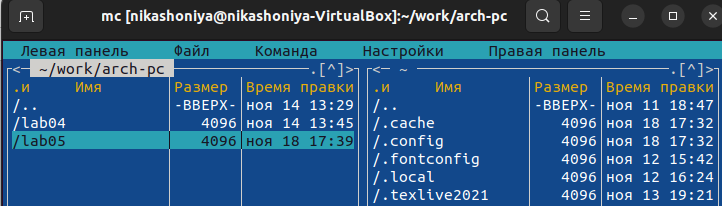

---
## Front matter
title: "Отчет по лабораторной работе №5"
subtitle: "Дисциплина: архитектура компьютера"
author: "Шония Ника Гигловна"

## Generic otions
lang: ru-RU
toc-title: "Содержание"

## Bibliography
bibliography: bib/cite.bib
csl: pandoc/csl/gost-r-7-0-5-2008-numeric.csl

## Pdf output format
toc: true # Table of contents
toc-depth: 2
lof: true # List of figures
lot: true # List of tables
fontsize: 12pt
linestretch: 1.5
papersize: a4
documentclass: scrreprt
## I18n polyglossia
polyglossia-lang:
  name: russian
  options:
	- spelling=modern
	- babelshorthands=true
polyglossia-otherlangs:
  name: english
## I18n babel
babel-lang: russian
babel-otherlangs: english
## Fonts
mainfont: PT Serif
romanfont: PT Serif
sansfont: PT Sans
monofont: PT Mono
mainfontoptions: Ligatures=TeX
romanfontoptions: Ligatures=TeX
sansfontoptions: Ligatures=TeX,Scale=MatchLowercase
monofontoptions: Scale=MatchLowercase,Scale=0.9
## Biblatex
biblatex: true
biblio-style: "gost-numeric"
biblatexoptions:
  - parentracker=true
  - backend=biber
  - hyperref=auto
  - language=auto
  - autolang=other*
  - citestyle=gost-numeric
## Pandoc-crossref LaTeX customization
figureTitle: "Рис."
tableTitle: "Таблица"
listingTitle: "Листинг"
lofTitle: "Список иллюстраций"
lotTitle: "Список таблиц"
lolTitle: "Листинги"
## Misc options
indent: true
header-includes:
  - \usepackage{indentfirst}
  - \usepackage{float} # keep figures where there are in the text
  - \floatplacement{figure}{H} # keep figures where there are in the text
---

# Цель работы

Приобретение навыков работы в Midnight Commander и освоение инструкций
языка ассемблера mov и int.

# Задание

 1. Основы работы с mc
 2. Структура программы на языке ассемблера NASM
 3. Подключение внешнего файла
 4. Выполнение заданий для самостоятельной работы

# Теоретическое введение

Midnight Commander (или просто mc) — это программа, которая позволяет просматривать структуру каталогов и выполнять основные операции по управлению файловой системой, т.е. mc является файловым менеджером. Midnight Commander позволяет сделать работу с файлами более удобной и наглядной. Программа на языке ассемблера NASM, как правило, состоит из трёх секций: секция кода программы (SECTION .text), секция инициированных (известных во время компиляции) данных (SECTION .data) и секция неинициализированных данных (тех, под которые во время компиляции только отводится память, а значение присваивается в ходе выполнения программы) (SECTION .bss). Для объявления инициированных данных в секции .data используются директивы DB, DW, DD, DQ и DT, которые резервируют память и указывают, какие значения должны храниться в этой памяти:

    DB (define byte) — определяет переменную размером в 1 байт;
    DW (define word) — определяет переменную размеров в 2 байта (слово);
    DD (define double word) — определяет переменную размером в 4 байта (двойное слово);
    DQ (define quad word) — определяет переменную размером в 8 байт (учетве- рённое слово);
    DT (define ten bytes) — определяет переменную размером в 10 байт. Директивы используются для объявления простых переменных и для объявления массивов. Для определения строк принято использовать директиву DB в связи с особенностями хранения данных в оперативной памяти. Инструкция языка ассемблера mov предназначена для дублирования данных источника в приёмнике.

mov dst,src

Здесь операнд dst — приёмник, а src — источник. В качестве операнда могут выступать регистры (register), ячейки памяти (memory) и непосредственные значения (const). Инструкция языка ассемблера intпредназначена для вызова прерывания с указанным номером.

int n

Здесь n — номер прерывания, принадлежащий диапазону 0–255. При программировании в Linux с использованием вызовов ядра sys_calls n=80h (принято задавать в шестнадцатеричной системе счисления).

# Выполнение лабораторной работы

1. Основы работы с mc
Открываю Midnight Commander {#fig:001 width=70%}
Перехожу в каталог ~/work/arch-pc созданный при выполнении лабораторной работы №4 {#fig:001 width=70%}
Создаю папку lab05 и перехожу в созданный каталог. {#fig:001 width=70%}
Пользуясь строкой ввода и командой touch создаю файл lab5-1.asm {#fig:001 width=70%}
2. Структура программы на языке ассемблера NASM
Открываю файл lab5-1.asm для редактирования во встроенном редакторе и ввожу текст программы из листинга {#fig:001 width=70%}
Открываю файл lab5-1.asm для просмотра. Убедилась, что файл содержит текст программы {#fig:001 width=70%}
Оттранслировала текст программы lab5-1.asm в объектный файл. Выполнила компоновку объектного файла и запустила получившийся исполняемый файл {#fig:001 width=70%}
3. Подключение внешнего файла
Скачала файл in_out.asm {#fig:001 width=70%}
Создаю копию файла lab5-1.asm с именем lab5-2.asm {#fig:001 width=70%}
Исправляю текст программы в файле lab5-2.asm с использование подпрограмм из
внешнего файла in_out.asm {#fig:001 width=70%}
Создаю исполняемый файл и проверяю его работу {#fig:001 width=70%}
4. Выполнение заданий для самостоятельной работы
Создаю копию файла lab5-1.asm. Вношу изменения в программу (без использования внешнего файла in_out.asm), так чтобы она работала по следующему алгоритму:
• вывести приглашение типа “Введите строку:”;
• ввести строку с клавиатуры;
• вывести введённую строку на экран. {#fig:001 width=70%}
Создаю файл и проверяю его {#fig:001 width=70%}
Создаю копию файла lab5-2.asm. Исправьте текст программы с использование подпрограмм из внешнего файла in_out.asm, так чтобы она работала по следующему
алгоритму:
• вывести приглашение типа “Введите строку:”;
• ввести строку с клавиатуры;
• вывести введённую строку на экран. {#fig:001 width=70%}
Создаю файл и проверяю его {#fig:001 width=70%}

# Выводы

При выполнении данной лабораторной работы я приобрела практические навыки работы в Midnight Commander, а также освоила инструкции языка ассемблера mov и int.

# Список литературы{.unnumbered}

Архитектура компьютера
Мой репозиторий: https://github.com/NikaShoniya/study_2023-2024_arch-pc
