---
## Front matter
title: "Отчет по лабораторной работе №6"
subtitle: "Дисциплина: архитектура компьютера"
author: "Шония Ника Гигловна"

## Generic otions
lang: ru-RU
toc-title: "Содержание"

## Bibliography
bibliography: bib/cite.bib
csl: pandoc/csl/gost-r-7-0-5-2008-numeric.csl

## Pdf output format
toc: true # Table of contents
toc-depth: 2
lof: true # List of figures
lot: true # List of tables
fontsize: 12pt
linestretch: 1.5
papersize: a4
documentclass: scrreprt
## I18n polyglossia
polyglossia-lang:
  name: russian
  options:
	- spelling=modern
	- babelshorthands=true
polyglossia-otherlangs:
  name: english
## I18n babel
babel-lang: russian
babel-otherlangs: english
## Fonts
mainfont: PT Serif
romanfont: PT Serif
sansfont: PT Sans
monofont: PT Mono
mainfontoptions: Ligatures=TeX
romanfontoptions: Ligatures=TeX
sansfontoptions: Ligatures=TeX,Scale=MatchLowercase
monofontoptions: Scale=MatchLowercase,Scale=0.9
## Biblatex
biblatex: true
biblio-style: "gost-numeric"
biblatexoptions:
  - parentracker=true
  - backend=biber
  - hyperref=auto
  - language=auto
  - autolang=other*
  - citestyle=gost-numeric
## Pandoc-crossref LaTeX customization
figureTitle: "Рис."
tableTitle: "Таблица"
listingTitle: "Листинг"
lofTitle: "Список иллюстраций"
lotTitle: "Список таблиц"
lolTitle: "Листинги"
## Misc options
indent: true
header-includes:
  - \usepackage{indentfirst}
  - \usepackage{float} # keep figures where there are in the text
  - \floatplacement{figure}{H} # keep figures where there are in the text
---

# Цель работы

Цель данной лабораторной работы - освоение арифметческих инструкций языка ассемблера NASM.
# Задание

1. Символьные и численные данные в NASM
2. Выполнение арифметических операций в NASM

# Теоретическое введение

Большинство инструкций на языке ассемблера требуют обработки операндов. Адрес операнда предоставляет место, где хранятся данные, подлежащие обработке. Это могут быть данные хранящиеся в регистре или в ячейке памяти.

    Регистровая адресация – операнды хранятся в регистрах и в команде используются имена этих регистров, например: mov ax,bx.
    Непосредственная адресация – значение операнда задается непосредственно в команде, Например: mov ax,2.
    Адресация памяти – операнд задает адрес в памяти. В команде указывается символическое обозначение ячейки памяти, над содержимым которой требуется выполнить операцию.

Ввод информации с клавиатуры и вывод её на экран осуществляется в символьном виде. Кодирование этой информации производится согласно кодовой таблице символов ASCII. ASCII – сокращение от American Standard Code for Information Interchange (Американский стандартный код для обмена информацией). Согласно стандарту ASCII каждый символ кодируется одним байтом. Среди инструкций NASM нет такой, которая выводит числа (не в символьном виде). Поэтому, например, чтобы вывести число, надо предварительно преобразовать его цифры в ASCII-коды этих цифр и выводить на экран эти коды, а не само число. Если же выводить число на экран непосредственно, то экран воспримет его не как число, а как последовательность ASCII-символов – каждый байт числа будет воспринят как один ASCII-символ – и выведет на экран эти символы. Аналогичная ситуация происходит и при вводе данных с клавиатуры. Введенные данные будут представлять собой символы, что сделает невозможным получение корректного результата при выполнении над ними арифметических операций. Для решения этой проблемы необходимо проводить преобразование ASCII символов в числа и обратно
# Выполнение лабораторной работы

1. Символьные и численные данные в NASM
Создаю каталог для программам лабораторной работы № 6, перехожу в него и
создаю файл lab6-1.asm 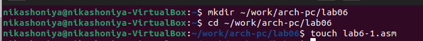{#fig:01 width=70%}
Открываю созданный файл lab6-1.asm, вставляю в него программу вывода значения регистра eax 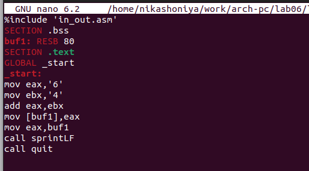{#fig:02 width=70%}
Создаю исполняемый файл программы и запускаю его. Вывод программы: символ j, потому что программа вывела символ, соответствующий по системе ASCII сумме двоичных кодов символов 4 и 6.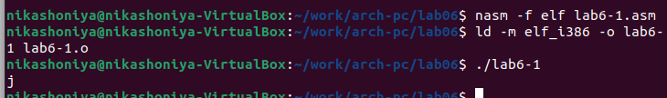{#fig:03 width=70%}
Изменяю в тексте программы символы "6" и "4" на цифры 6 и 4 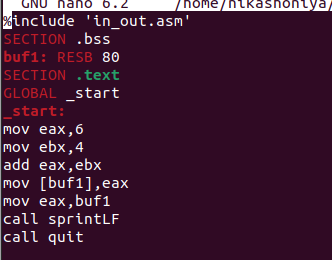{#fig:04 width=70%}
Создаю новый исполняемый файл программы и запускаю его. Теперь вывелся символ с кодом 10, это символ перевода строки, этот символ не отображается при выводе на экран. 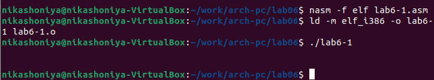{#fig:05 width=70%}
Создаю новый файл lab6-2.asm с помощью утилиты touch 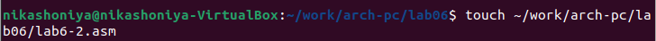{#fig:06 width=70%}
Ввожу в файл текст другойпрограммы для вывода значения регистра eax 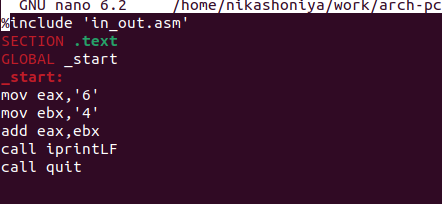{#fig:07 width=70%}
Создаю и запускаю исполняемый файл lab6-2. Теперь вывод число 106, потому что программа позволяет вывести именно число, а не символ, хотя все еще происходит именно сложение кодов символов "6" и "4". 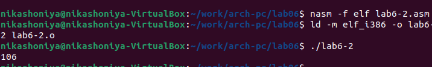{#fig:08 width=70%}
Заменяю в тексте программы в файле lab6-2.asm символы "6" и "4" на числа 6 и 4 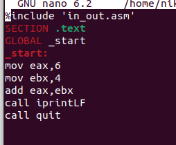{#fig:09 width=70%}
Создаю и запускаю новый исполняемый файл. Теперь программа складывает не соответствующие символам коды в системе ASCII, а сами числа, поэтому вывод 10. 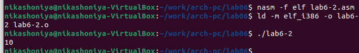{#fig:10 width=70%}
Заменяю в тексте программы функцию iprintLF на iprint 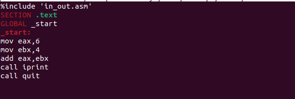{#fig:18 width=70%}
Создаю и запускаю новый исполняемый файл. Вывод не изменился, потому что символ переноса строки не отображался, когда программа исполнялась с функцией iprintLF, а iprint не добавляет к выводу символ переноса строки, в отличие от iprintLF. {#fig:10 width=70%}
2. Выполнение арифметических операций в NASM
Создаю файл lab6-3.asm с помощью утилиты touch 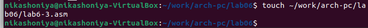{#fig:11 width=70%}
Ввожу в созданный файл текст программы для вычисления значения выражения f(x) = (5 * 2 + 3)/3 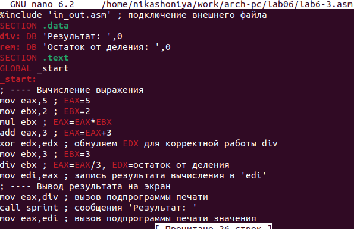{#fig:19 width=70%}
Создаю исполняемый файл и запускаю его 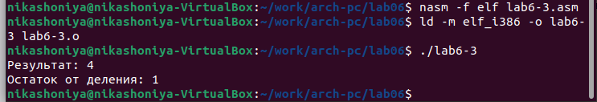{#fig:12 width=70%}
Изменяю программу так, чтобы она вычисляла значение выражения f(x) = (4 * 6 + 2)/5 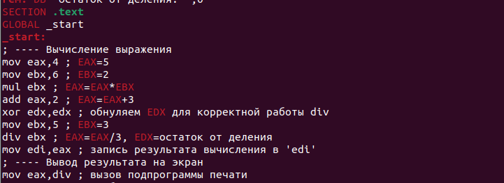{#fig:13 width=70%}
Создаю и запускаю новый исполняемый файл. Я посчитала для проверки правильности работы программы значение выражения самостоятельно, программа отработала верно. 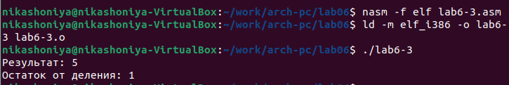{#fig:14 width=70%}
Создаю файл variant.asm с помощью утилиты touch 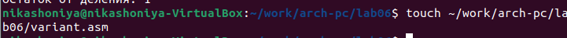{#fig:15 width=70%}
Ввожу в файл текст программы для вычисления варианта задания по номеру студенческого билета 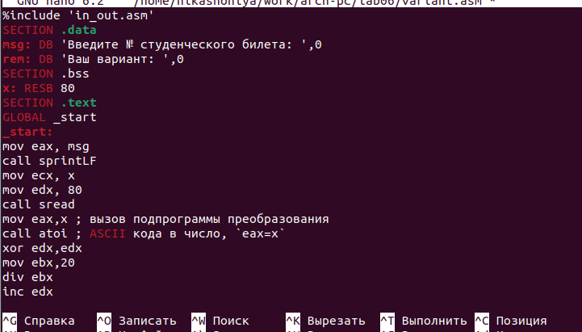{#fig:16 width=70%}
Создаю и запускаю исполняемый файл. Ввожу номер своего студ. билета с клавиатуры, программа вывела, что мой вариант - 11 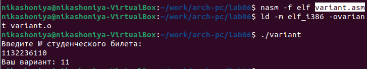{#fig:17 width=70%}
Ответы на вопросы:
1. За вывод сообщения "Ваш вариант" отвечают строки кода:mov eax,rem call sprint
2. Инструкция mov ecx, x используется, чтобы положить адрес вводимой строки x в регистр ecx mov edx, 80 - запись в регистр edx длины вводимой строки call sread - вызов подпрограммы из внешнего файла, обеспечивающей ввод сообщения с клавиатуры
3. call atoi используется для вызова подпрограммы из внешнего файла, которая преобразует ascii-код символа в целое число и записывает результат в регистр eax
4. За вычисления варианта отвечают строки:
xor edx,edx ; обнуление edx для корректной работы div
mov ebx,20 ; ebx = 20
div ebx ; eax = eax/20, edx - остаток от деления
inc edx ; edx = edx + 1
5. При выполнении инструкции div ebx остаток от деления записывается в регистр edx
6. Инструкция inc edx увеличивает значение регистра edx на 1
7. За вывод на экран результатов вычислений отвечают строки:
mov eax,edx
call iprintLF

# Выводы

При выполнении данной лабораторной работы я освоила арифметические инструкции языка ассемблера NASM.

# Список литературы{.unnumbered}

Архитектура ЭВМ 
Мой репозиторий: https://github.com/NikaShoniya/study_2023-2024_arch-pc
