---
## Front matter
title: "Отчет по лабораторной работе №7"
subtitle: "Дисциплина: архитектура компьютера"
author: "Шония Ника Гигловна"

## Generic otions
lang: ru-RU
toc-title: "Содержание"

## Bibliography
bibliography: bib/cite.bib
csl: pandoc/csl/gost-r-7-0-5-2008-numeric.csl

## Pdf output format
toc: true # Table of contents
toc-depth: 2
lof: true # List of figures
lot: true # List of tables
fontsize: 12pt
linestretch: 1.5
papersize: a4
documentclass: scrreprt
## I18n polyglossia
polyglossia-lang:
  name: russian
  options:
	- spelling=modern
	- babelshorthands=true
polyglossia-otherlangs:
  name: english
## I18n babel
babel-lang: russian
babel-otherlangs: english
## Fonts
mainfont: PT Serif
romanfont: PT Serif
sansfont: PT Sans
monofont: PT Mono
mainfontoptions: Ligatures=TeX
romanfontoptions: Ligatures=TeX
sansfontoptions: Ligatures=TeX,Scale=MatchLowercase
monofontoptions: Scale=MatchLowercase,Scale=0.9
## Biblatex
biblatex: true
biblio-style: "gost-numeric"
biblatexoptions:
  - parentracker=true
  - backend=biber
  - hyperref=auto
  - language=auto
  - autolang=other*
  - citestyle=gost-numeric
## Pandoc-crossref LaTeX customization
figureTitle: "Рис."
tableTitle: "Таблица"
listingTitle: "Листинг"
lofTitle: "Список иллюстраций"
lotTitle: "Список таблиц"
lolTitle: "Листинги"
## Misc options
indent: true
header-includes:
  - \usepackage{indentfirst}
  - \usepackage{float} # keep figures where there are in the text
  - \floatplacement{figure}{H} # keep figures where there are in the text
---

# Цель работы

Изучение команд условного и безусловного переходов. Приобретение навыков написания программ с использованием переходов и знакомство с назначением и структурой файла листинга.

# Задание

1. Реализация переходов в NASM
2. Изучение структуры файлы листинга
3. Задание для самостоятельной работы

# Теоретическое введение

Для реализации ветвлений в ассемблере используются так называемые команды передачи
управления или команды перехода. Можно выделить 2 типа переходов:
• условный переход – выполнение или не выполнение перехода в определенную точку
программы в зависимости от проверки условия.
• безусловный переход – выполнение передачи управления в определенную точку про-
граммы без каких-либо условий.

# Выполнение лабораторной работы

1. Реализация переходов в NASM
Создаю каталог для программам лабораторной работы № 7, перехожу в него и со-
здаю файл lab7-1.asm 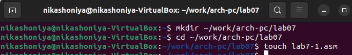{#fig:001 width=70%}
Ввожу в файл lab7-1.asm текст программы из листинга 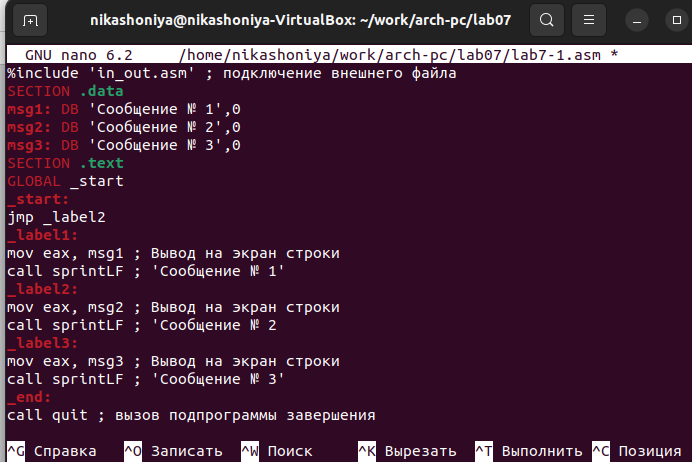{#fig:001 width=70%}
Создаю исполняемый файл и запускаю его 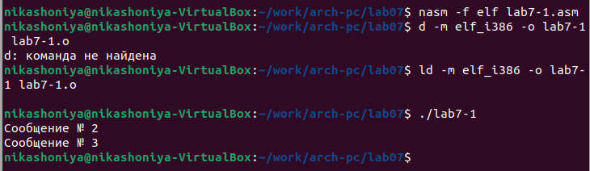{#fig:001 width=70%}
Изменяю программу таким образом, чтобы она выводила сначала ‘Сообщение № 2’, потом ‘Сообщение
№ 1’ и завершала работу 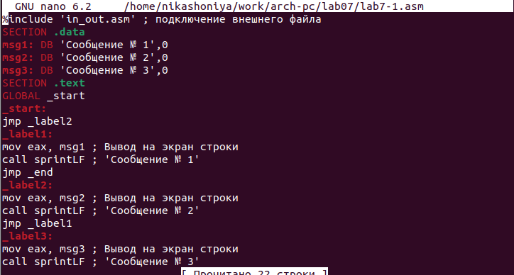{#fig:001 width=70%}
Создаю исполняемый файл и запускаю его 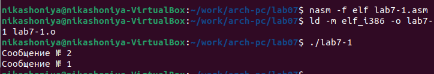{#fig:001 width=70%}
Создаю файл lab7-2.asm в каталоге ~/work/arch-pc/lab07 {#fig:001 width=70%}
Ввожу текст программы в lab7-2.asm 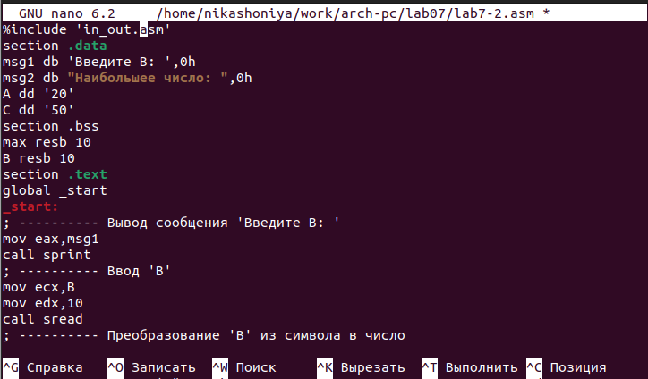{#fig:001 width=70%}
Создаю исполняемый файл и проверяю его работу для разных значений B 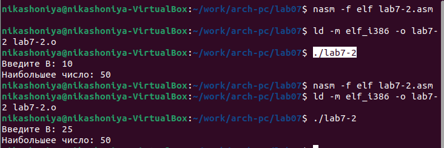{#fig:001 width=70%}
2. Изучение структуры файлы листинга
Создаю файл листинга для программы из файла lab7-2.asm 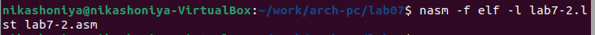{#fig:001 width=70%}
Открываю файл листинга lab7-2.lst с помощью текстового редактора 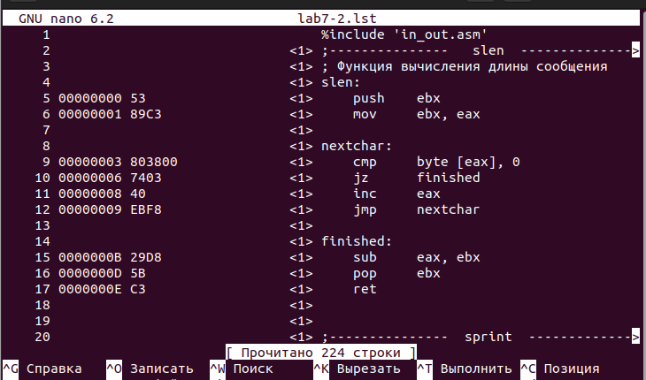{#fig:001 width=70%}
Открываю файл с программой lab7-2.asm и в любой инструкции с двумя операндами
удаляю один операнд. Выполняю трансляцию с получением файла листинга. Выдаёт ошибку после этого действия 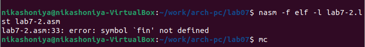{#fig:001 width=70%}
Также в файле листинга пишут про ошибку 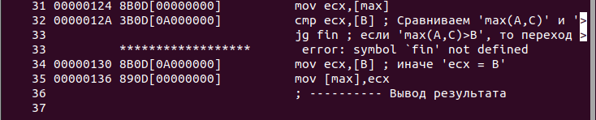{#fig:001 width=70%}
3. Задание для самостоятельной работы
Написала программу нахождения наименьшей из 3 целочисленных переменных 𝑎,𝑏 и .
Значения переменных 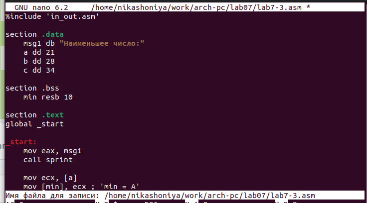{#fig:001 width=70%}
Создаю исполняемый файл и проверяю его работу.{#fig:001 width=70%}
# Выводы

Я изучила командыусловного и безусловного переходов и научилась писать программы с использованием этих переходов.

# Список литературы{.unnumbered}

Архитектура компьютера 
Мой репозиторий: https://github.com/NikaShoniya/study_2023-2024_arch-pc
