---
## Front matter
title: "Отчет по лабораторной работе №8"
subtitle: "Дисциплина: архитектура компьютера"
author: "Шония Ника Гигловна"

## Generic otions
lang: ru-RU
toc-title: "Содержание"

## Bibliography
bibliography: bib/cite.bib
csl: pandoc/csl/gost-r-7-0-5-2008-numeric.csl

## Pdf output format
toc: true # Table of contents
toc-depth: 2
lof: true # List of figures
lot: true # List of tables
fontsize: 12pt
linestretch: 1.5
papersize: a4
documentclass: scrreprt
## I18n polyglossia
polyglossia-lang:
  name: russian
  options:
	- spelling=modern
	- babelshorthands=true
polyglossia-otherlangs:
  name: english
## I18n babel
babel-lang: russian
babel-otherlangs: english
## Fonts
mainfont: PT Serif
romanfont: PT Serif
sansfont: PT Sans
monofont: PT Mono
mainfontoptions: Ligatures=TeX
romanfontoptions: Ligatures=TeX
sansfontoptions: Ligatures=TeX,Scale=MatchLowercase
monofontoptions: Scale=MatchLowercase,Scale=0.9
## Biblatex
biblatex: true
biblio-style: "gost-numeric"
biblatexoptions:
  - parentracker=true
  - backend=biber
  - hyperref=auto
  - language=auto
  - autolang=other*
  - citestyle=gost-numeric
## Pandoc-crossref LaTeX customization
figureTitle: "Рис."
tableTitle: "Таблица"
listingTitle: "Листинг"
lofTitle: "Список иллюстраций"
lotTitle: "Список таблиц"
lolTitle: "Листинги"
## Misc options
indent: true
header-includes:
  - \usepackage{indentfirst}
  - \usepackage{float} # keep figures where there are in the text
  - \floatplacement{figure}{H} # keep figures where there are in the text
---

# Цель работ
Изучение навыков написания программ с использованием циклов и обработкой
аргументов командной строки.
# Задание

1. Реализация циклов в NASM
2. Обработка аргументов командной строки
3. Задание для самостоятельной работы

# Теоретическое введение

Стек — это структура данных, организованная по принципу LIFO («Last In — First Out»
или «последним пришёл — первым ушёл»). Стек является частью архитектуры процессора и
реализован на аппаратном уровне. Для работы со стеком в процессоре есть специальные
регистры (ss, bp, sp) и команды.
Основной функцией стека является функция сохранения адресов возврата и передачи
аргументов при вызове процедур. Кроме того, в нём выделяется память для локальных
переменных и могут временно храниться значения регистров.
На рис. 8.1 показана схема организации стека в процессоре.
Стек имеет вершину, адрес последнего добавленного элемента, который хранится в ре-
гистре esp (указатель стека). Противоположный конец стека называется дном. Значение,
помещённое в стек последним, извлекается первым. При помещении значения в стек указа-
тель стека уменьшается, а при извлечении — увеличивается.
Для стека существует две основные операции:
• добавление элемента в вершину стека (push);
• извлечение элемента из вершины стека (pop).

# Выполнение лабораторной работы

1. Реализация циклов в NASM
Создаю каталог для программам лабораторной работы № 8, перехожу в него и создаю
файл lab8-1.asm 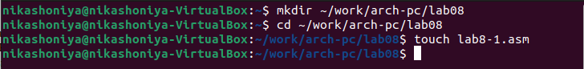{#fig:001 width=70%}
Ввожу в файл lab8-1.asm текст программы из листинга 8.1. Создаю исполняемый файл
и проверяю его работу 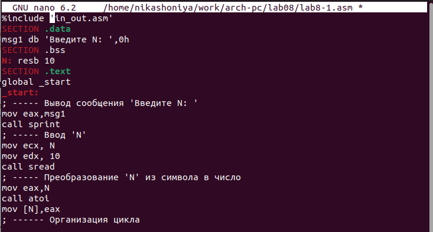{#fig:001 width=70%} 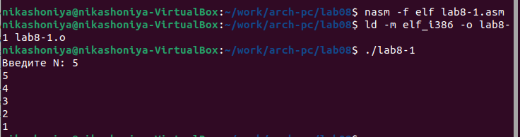{#fig:001 width=70%}
 Изменяю текст программы добавив изменение значение регистра ecx в цикле 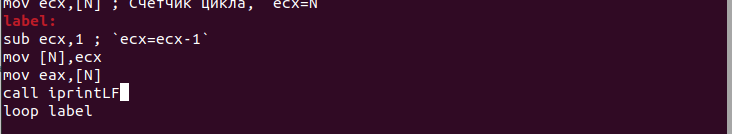{#fig:001 width=70%}
Создаю исполняемый файл и проверяю его работу. Число проходов цикла не совпадает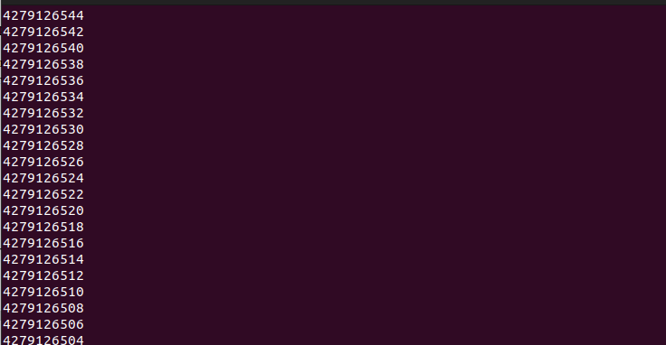{#fig:001 width=70%}
Вношу изменения в текст программы добавив команды push и pop (добавления в стек и извлечения из стека) для сохранения значения счетчика цикла loop 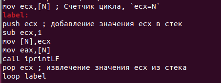{#fig:001 width=70%}
Создаю исполняемый файл и проверяю его работу. Число проходов цикла совпадает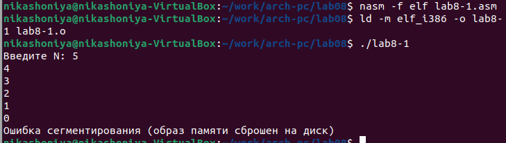{#fig:001 width=70%}
2. Обработка аргументов командной строки
Рассмотрим программу, которая выводит на экран аргументы командной строки в файле lab8-2.asm. 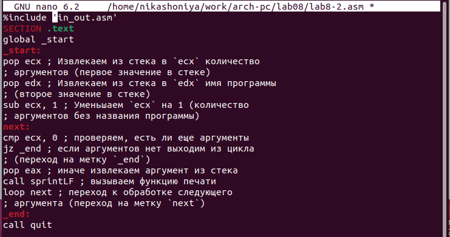{#fig:001 width=70%}
Создаю исполняемый файл и запускаю его, указав аргументы 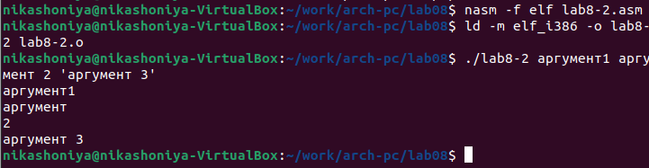{#fig:001 width=70%}
В файле lab8-3.asm в каталоге ~/work/arch-pc/lab08 и ввожу в него текст программы 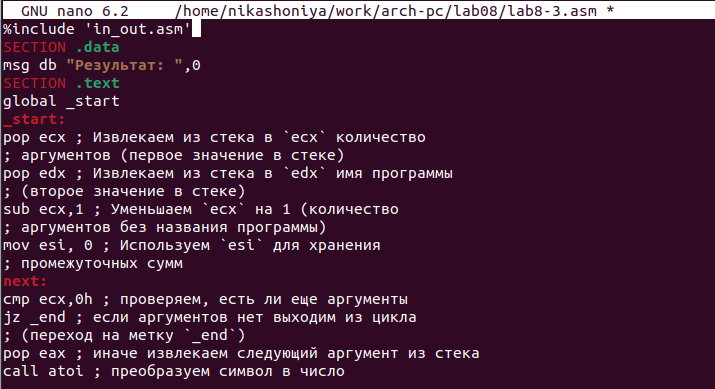{#fig:001 width=70%}
Создаю исполняемый файл и запускаю его, указав аргументы 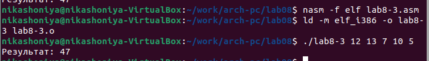{#fig:001 width=70%}
Измените текст программы для вычисления произведения аргументов командной строки. 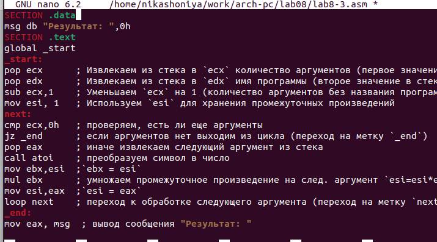{#fig:001 width=70%}
Создаю исполняемый файл и проверяю его работу 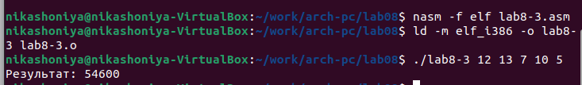{#fig:001 width=70%}
3. Задание для самостоятельной работы
Вывожу результат программы, которая находит сумму значений функции 𝑓(𝑥) для 𝑥 = 𝑥1, 𝑥2, ..., 𝑥𝑛,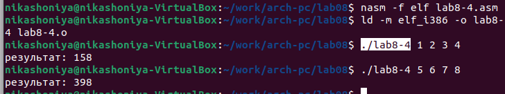{#fig:001 width=70%}

# Выводы

Были получены по организации циклов и работе со стеком на языке NASM.

# Список литературы{.unnumbered}

Мой репозиторий: https://github.com/NikaShoniya/study_2023-2024_arch-pc
