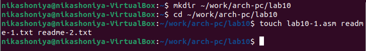
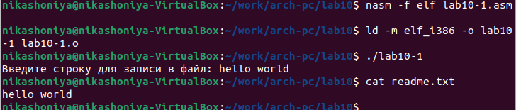
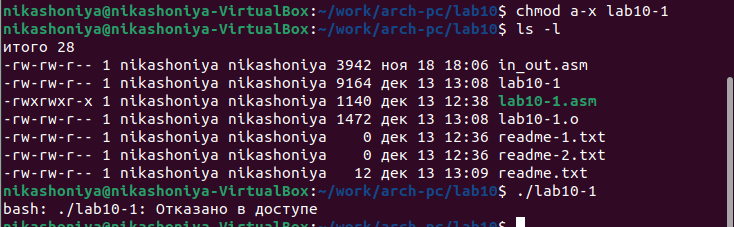
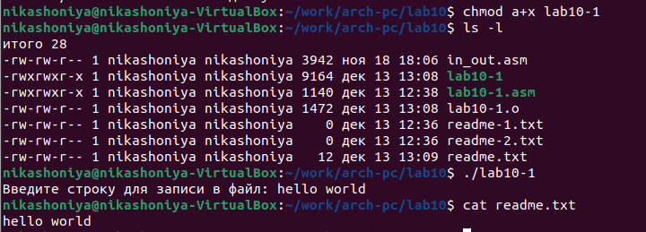
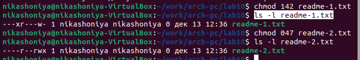
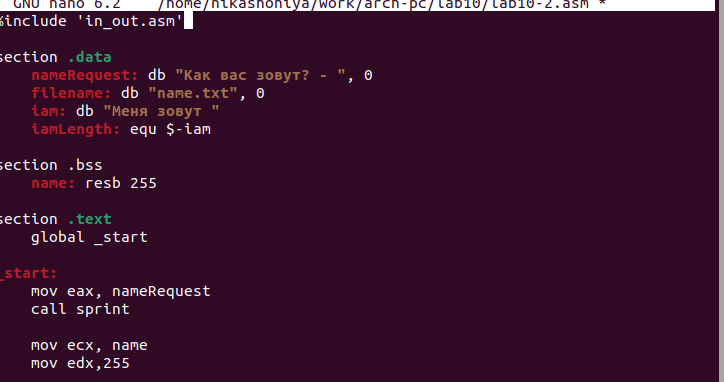
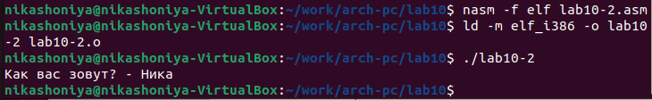
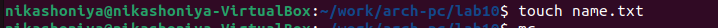
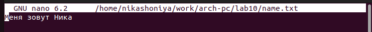

---
## Front matter
title: "Лабораторная работа №10"
subtitle: "Дисциплина: архитектура компьютера"
author: "Шония Ника Гигловна"

## Generic otions
lang: ru-RU
toc-title: "Содержание"

## Bibliography
bibliography: bib/cite.bib
csl: pandoc/csl/gost-r-7-0-5-2008-numeric.csl

## Pdf output format
toc: true # Table of contents
toc-depth: 2
lof: true # List of figures
lot: true # List of tables
fontsize: 12pt
linestretch: 1.5
papersize: a4
documentclass: scrreprt
## I18n polyglossia
polyglossia-lang:
  name: russian
  options:
	- spelling=modern
	- babelshorthands=true
polyglossia-otherlangs:
  name: english
## I18n babel
babel-lang: russian
babel-otherlangs: english
## Fonts
mainfont: PT Serif
romanfont: PT Serif
sansfont: PT Sans
monofont: PT Mono
mainfontoptions: Ligatures=TeX
romanfontoptions: Ligatures=TeX
sansfontoptions: Ligatures=TeX,Scale=MatchLowercase
monofontoptions: Scale=MatchLowercase,Scale=0.9
## Biblatex
biblatex: true
biblio-style: "gost-numeric"
biblatexoptions:
  - parentracker=true
  - backend=biber
  - hyperref=auto
  - language=auto
  - autolang=other*
  - citestyle=gost-numeric
## Pandoc-crossref LaTeX customization
figureTitle: "Рис."
tableTitle: "Таблица"
listingTitle: "Листинг"
lofTitle: "Список иллюстраций"
lotTitle: "Список таблиц"
lolTitle: "Листинги"
## Misc options
indent: true
header-includes:
  - \usepackage{indentfirst}
  - \usepackage{float} # keep figures where there are in the text
  - \floatplacement{figure}{H} # keep figures where there are in the text
---

# Цель работы

Приобретение знаний о написании программ для работы с файлами.

# Задание

1. Выполнение команд по приобритению прав
2. Самостоятельная работа

# Теоретическое введение

ОС GNU/Linux является многопользовательской операционной системой. И для обеспече-
ния защиты данных одного пользователя от действий других пользователей существуют
специальные механизмы разграничения доступа к файлам. Кроме ограничения доступа, дан-
ный механизм позволяет разрешить другим пользователям доступ данным для совместной
работы.
Права доступа определяют набор действий (чтение, запись, выполнение), разрешённых
для выполнения пользователям системы над файлами. Для каждого файла пользователь
может входить в одну из трех групп: владелец, член группы владельца, все остальные. Для
каждой из этих групп может быть установлен свой набор прав доступа. Владельцем файла
является его создатель. Для предоставления прав доступа другому пользователю или другой
группе командой
chown [ключи] <новый_пользователь>[:новая_группа] <файл>
или
chgrp [ключи] < новая_группа > <файл>
Набор прав доступа задается тройками битов и состоит из прав на чтение, запись и ис-
полнение файла. В символьном представлении он имеет вид строк rwx, где вместо любого
символа может стоять дефис. Всего возможно 8 комбинаций, приведенных в таблице 10.1.
Буква означает наличие права (установлен в единицу второй бит триады r — чтение, первый
бит w — запись, нулевой бит х — исполнение), а дефис означает отсутствие права (нулевое
значение соответствующего бита). Также права доступа могут быть представлены как вось-
меричное число. Так, права доступа rw- (чтение и запись, без исполнения) понимаются как
три двоичные цифры 110 или как восьмеричная цифра 6

# Выполнение лабораторной работы

1. Выполнение команд по приобритению прав
Создаю каталог для программам лабораторной работы № 10, перехожу в него и
создаю файлы lab10-1.asm, readme-1.txt и readme-2.txt {#fig:001 width=70%}
Ввожу в файл lab10-1.asm текст программы из листинга и проверяю его {#fig:001 width=70%}
С помощью команды chmod изменяю права доступа к файлу lab10-1.asm с исходным текстом программы, запрещая права на исполнение. {#fig:001 width=70%}
С помощью команды chmod изменяю права доступа к файлу lab10-1.asm с исходным текстом программы, добавляя права на исполнение. {#fig:001 width=70%}
Предоставляю права доступа к файлу readme-1.txt представленные в символьном виде, а для файла readme-2.txt – в двочном виде и проверяю. {#fig:001 width=70%}
2. Самостоятельная работа
Создаю программу для вывода имени {#fig:001 width=70%}
Проверяю файл {#fig:001 width=70%}
Создаю файл name.txt {#fig:001 width=70%}
Записала в файл сообщение {#fig:001 width=70%}

# Выводы

Я овладела навыками написания программ для работы с файлами.

# Список литературы{.unnumbered}

Мой репозиторий: https://github.com/NikaShoniya/study_2023-2024_arch-pc
